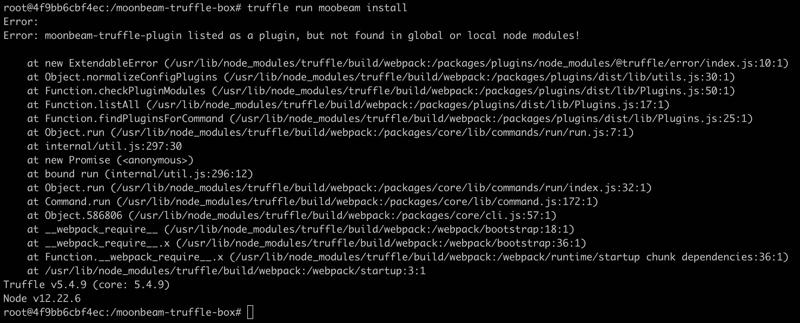

# FAQ - 常见问题答疑  
本节主要整理一些常见问题，如Moonbeam组件使用方式、调试或运行中出现的问题、有益的改进方案等；

## Q1: Moonbeam是如何考虑使用Substrate和Polakdot的？
A: Substrate是开发Moonbeam的现有最优选择，它是功能强大的区块链开发框架。Moonbeam基于Substrate框架开发，可以物尽其用Substrate的各类功能，比如「开箱即用」功能等，从而省去从零开发的成本；Polkadot网络生态与Moonbeam相辅相成。作为Polkadot上的平行链，Moonbeam将能直接与网络上的任何平行链和平行线程集成，还可利用桥服务，帮助任何独立构建的（非Polkadot生态）链，连接Polkadot生态与外部网络，包括与以太坊桥接的转接桥。

## Q2: Moonbeam有哪几种开发运行方式？  
A: truffle box和native code编译方式；本地方式能更深入了解moonbeam具体实现，truffle box方式则更加自动化；也可以利用remix在线编译，并upload到moonbase alpha测试网。

## Q3: truffle run moonbeam install报错：Error:moonbeam-truffle-plugin listed as a plugin,but not found in global or local node modules!
   
A: 在$Path环境变量里面加上/.npm-global/bin/

## Q3. 安装最新的nodejs truffle安装失败了，哪个nodejs版本比较好？

A: v15.x

比视频课程中的版本高也是可以的，目前没有发现nodejs最新版不兼容问题。


## Q4. 安装报错如下

```
Error: moonbeam-truffle-plugin listed as a plugin, but not found in global or local node modules!  

```

处理方式：

```
cd moonbeam-truffle-box
npm install @truffle/hdwallet-provider
```

再运行

```
npm install
```

最后在开启docker后运行

```
truffle run moonbeam install 
```

以上就可以安装成功了。


## Q5. 安装报错如下

```
(base) ➜  moonbeam-truffle-box truffle run moonbeam install
Error:
Error: moonbeam-truffle-plugin listed as a plugin, but not found in global or local node modules!

    at new ExtendableError (/usr/local/lib/node_modules/truffle/build/webpack:/packages/plugins/node_modules/@truffle/error/index.js:10:1)
    at Object.normalizeConfigPlugins (/usr/local/lib/node_modules/truffle/build/webpack:/packages/plugins/dist/lib/utils.js:30:1)
    at Function.checkPluginModules (/usr/local/lib/node_modules/truffle/build/webpack:/packages/plugins/dist/lib/Plugins.js:50:1)
    at Function.listAll (/usr/local/lib/node_modules/truffle/build/webpack:/packages/plugins/dist/lib/Plugins.js:17:1)
    at Function.findPluginsForCommand (/usr/local/lib/node_modules/truffle/build/webpack:/packages/plugins/dist/lib/Plugins.js:25:1)
    at Object.run (/usr/local/lib/node_modules/truffle/build/webpack:/packages/core/lib/commands/run/run.js:7:1)
    at internal/util.js:297:30
    at new Promise (<anonymous>)
    at bound run (internal/util.js:296:12)
    at Object.run (/usr/local/lib/node_modules/truffle/build/webpack:/packages/core/lib/commands/run/index.js:32:1)
    at Command.run (/usr/local/lib/node_modules/truffle/build/webpack:/packages/core/lib/command.js:172:1)
    at Object.586806 (/usr/local/lib/node_modules/truffle/build/webpack:/packages/core/cli.js:57:1)
    at __webpack_require__ (/usr/local/lib/node_modules/truffle/build/webpack:/webpack/bootstrap:18:1)
    at __webpack_require__.x (/usr/local/lib/node_modules/truffle/build/webpack:/webpack/bootstrap:36:1)
    at Function.__webpack_require__.x (/usr/local/lib/node_modules/truffle/build/webpack:/webpack/runtime/startup chunk dependencies:36:1)
    at /usr/local/lib/node_modules/truffle/build/webpack:/webpack/startup:3:1
Truffle v5.4.10 (core: 5.4.10)
Node v14.15.3
```


A:

```
npm install -g @truffle/hdwallet-provider
我全局安装一直失败，后来就我直接安装在moonbeam-truffle-box下也是可以的

cd moonbeam-truffle-box
npm install @truffle/hdwallet-provider
```

## Q6. truffle run moonbeam start 启动的时候用的端口是 9933， 如何修改 moonbeam start 的docker 占用的端口？

A:
1. 先检查是否已经在运行一个Moonbeam Docker 容器了 ，如果已经有运行，就不要再开第二个了。
2. 要修改hostconfig.json, 可参考：```https://stackoverflow.com/questions/19335444/how-do-i-assign-a-port-mapping-to-an-existing-docker-container```


## Q7. 直接在mac操作是不需要用到docker了吗？

A: 可以不用Docker，第四课也会介绍Moonbase Alpha测试网 所以不想在本地运行节点也可以直接部署到测试网。

## Q8. 测试代币领取问题：按照视频里介绍的discord获取代币的方法，机器人回复Transaction of funds消息后，为什么metamask里显示代码还是0 DEV啊？

A: 确认你的metamask连接了Moonbase Alpha，用浏览器查一下transaction hash。

浏览器地址： ```https://moonbase-blockscout.testnet.moonbeam.network/```

```https://docs.moonbeam.network/cn/getting-started/moonbase/metamask/``` Metamask连接Moonbase Alpha的方法

## Q9. 部署网络问题

A: 国内可能有网络问题。不要开命令行代理，直接migrate，这样也许还能成，还有就是账户里要有钱，先去水龙头搞测试币。

部署遇timeout，多试几次。

如果遇到网络问题，也可以试试开全局代码。


## Q10. gas price问题，我的gas price 为0，cost为 0，正常吗我的gas price 为0，cost为 0，正常吗？

A: 本地开发节点是可以这样的


## Q11. 安装问题，找不到这个模块 truffle/hdwallet-provider

A:

```aidl
npm install @truffle/hdwallet-provider
```

## Q12. 课程中discord链接失效

A: 第四课 Discord 邀请链接过期， 请用这个邀请链接：https://discord.gg/ssvKu6Un8v
